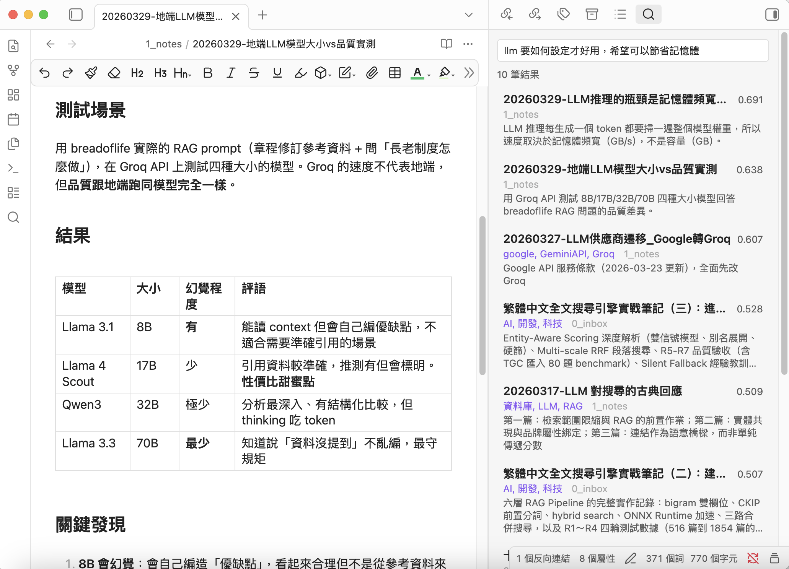
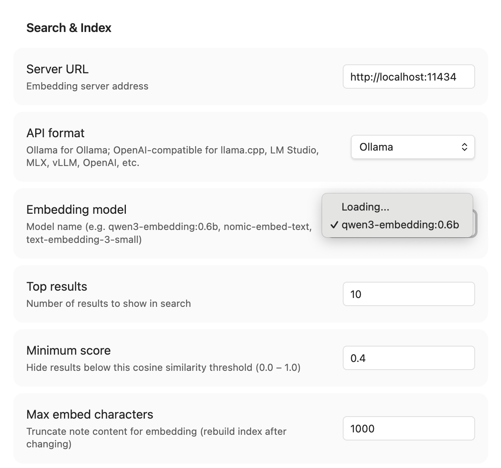
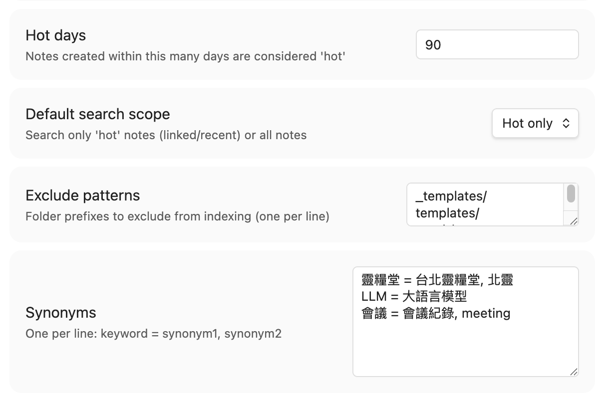
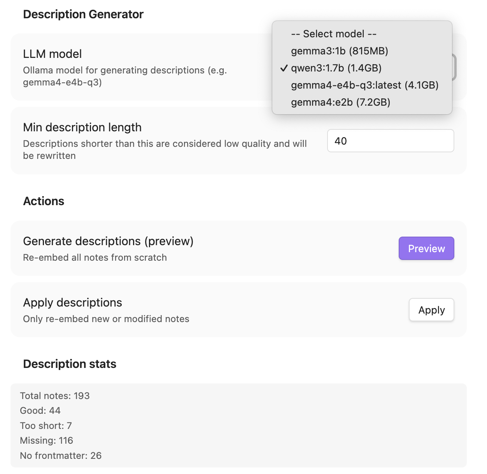
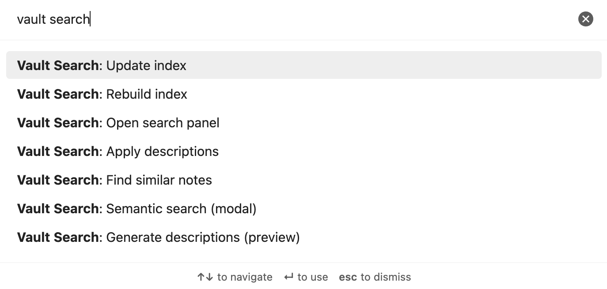

<p align="center">
  <h1 align="center">Vault Search</h1>
  <p align="center">Obsidian 本地語意搜尋 — 簡單、隱私、中文友善</p>

<p align="center">
  <a href="https://github.com/notoriouslab/vault-search/releases"></a>
  <a href="https://github.com/notoriouslab/vault-search/blob/main/LICENSE"></a>
  
  
</p>

<p align="center">
  <a href="./README.md">English</a>
</p>

---

> *Vault Search 專注把『懂意思的搜尋』做到又簡單又好用*

不需要雲端服務、不需要 API Key、不需要付費訂閱。筆記不離開你的電腦。



## 為什麼選擇 Vault Search？

[Andrej Karpathy 分享了](https://venturebeat.com/data/karpathy-shares-llm-knowledge-base-architecture-that-bypasses-rag-with-an/)他用 LLM 維護知識庫的願景 — 讓 AI「編譯」你的筆記成結構化 wiki。這是個很吸引人的做法，但前提是你願意把編輯權完全交給 LLM。

**Vault Search 則認為：** 我們相信你的原始筆記有其根本價值。最好的搜尋系統不是取代你的寫作，而是幫你<font color="#ff0000">重新發現它</font>。RAG 和語意搜尋之所以強大，正是因為它們與你的既有內容*協作*，而非凌駕其上。

### 核心優勢

**完全本地，真正隱私** — 所有 embedding、索引、搜尋、描述生成都在你的電腦上完成。沒有資料離開你的機器。這不是一個開關選項，而是架構本身。

**極簡且高效** — 右側邊欄常駐顯示搜尋結果，Cmd/Ctrl+P 快速彈出搜尋視窗，一鍵「尋找相似」立即找到相關筆記。介面乾淨、操作直覺。

**專為中文優化** — 官方推薦 `qwen3-embedding:0.6b`，對繁體中文與英文的語意理解表現優秀。結合同義詞擴展，即使你用不同詞彙描述相同概念，也能找到想要的筆記。

**智慧分層優先** — Hot/Cold 機制自動優先顯示近期修改或有雙向連結的筆記，讓搜尋結果更貼近你的實際使用習慣。冷門筆記不會稀釋結果。

**LLM 自動生成描述** — 用本地 LLM 為筆記產生 description frontmatter，讓 embedding 不再只看原始內容，而是包含高品質摘要。搜尋相關性明顯更好 — 這是其他輕量插件少見的功能。

**輕量，8GB 就能跑** — 設計極簡，記憶體與 CPU 佔用低。推薦模型在 Macbook M2 8GB 筆電上就可以使用。增量索引 + debounce 機制，日常使用幾乎感覺不到負擔。

**高度彈性** — 除了 Ollama，也支援 LM Studio、llama.cpp、vLLM 等 OpenAI-compatible 伺服器。自由選擇最適合你的模型。

**可選 Chunking** — 長文使用者可開啟 chunking 搜尋特定段落，三種模式：
關閉（預設）
智慧（有 description 的跳過）
全部

一般使用者可以不用 Chunking，但進階使用者可以依照需要調整。

> *「在隱私、輕量、中文表現、搜尋體驗之間取得極佳平衡。」*
>
> *「適合已經習慣『一篇筆記聚焦一個主題 + YAML 描述』的使用者，也為長內容使用者準備了升級路徑。」*

## 功能

- **語意搜尋** — 用模糊描述找到相關筆記，不只是關鍵字比對，描述越多，找到的文件越精準
- **側邊欄面板** — 搜尋結果固定在右側，點開筆記不會消失
- **快速搜尋彈窗** — Cmd/Ctrl+P 快速跳轉
- **尋找相似筆記** — 打開任一筆記，即時發現相關筆記（不需呼叫 API）
- **智慧索引** — 增量更新，只重新 embed 變更的筆記，檔案修改時自動觸發
- **Hot/Cold 分層** — 有連結、近期建立的筆記優先顯示
- **Chunking** — 可選的長文分段搜尋（預設關閉）
- **Description 生成器** — 用本地 LLM 為筆記生成 frontmatter 描述，提升搜尋品質
- **同義詞擴展** — 自訂同義詞提升搜尋召回率
- **多格式 API** — 支援 Ollama 和 OpenAI-compatible（LM Studio、llama.cpp、vLLM 等）
- **雙語介面** — 繁體中文與英文，根據 Obsidian 語言設定自動切換

## 需求

- [Ollama](https://ollama.com/) 已安裝並執行中
- 已下載 embedding 模型（例如 `ollama pull qwen3-embedding:0.6b`）
- 已下載 LLM 分析模型（例如 `ollama pull qwen3:1.7b` ）（Description 生成選項）
- Obsidian 桌面版（目前尚未有手機版規劃）

## 安裝

### BRAT（推薦）

1. 安裝 [BRAT](https://github.com/TfTHacker/obsidian42-brat) plugin
2. 新增本 repo：`notoriouslab/vault-search`
3. 在 Community plugins 啟用「Vault Search」

### 手動安裝

1. 從 [Releases](https://github.com/notoriouslab/vault-search/releases) 下載 `main.js`、`manifest.json`、`styles.css`
2. 複製到 vault 的 `.obsidian/plugins/vault-search/`
3. 在 Settings → Community plugins 啟用

## 快速開始

1. **Settings → Vault Search** → 選擇 Embedding 模型
2. 按 **重建** 建立索引
3. **Cmd/Ctrl+P → 「Vault Search: 語意搜尋」** 或點左側 ribbon icon

### 推薦工作流

要獲得最佳搜尋品質，建議按這個順序操作：

```
1. 生成 Description  →  2. 重建索引  →  3. 搜尋
   （LLM 彙整摘要）      （用 description embed）   （享受更好的結果）
```

**為什麼順序重要？** Indexer 會優先使用 frontmatter `description` 來做 embedding。先生成 description 再建索引，embedding 捕捉到的是高品質摘要而非原始內容，搜尋相關性會明顯提升，尤其是長筆記。

- **最簡模式**：跳過步驟 1，直接 Rebuild + 搜尋。短筆記效果就很好。
- **最佳品質**：先跑「生成 description（預覽）」→ 看報告 → 「套用 description」→ 再「重建索引」。
- **搭配 Chunking**：用「智慧」模式 — 有 description 的筆記用摘要 embed，沒有的自動 chunk。

## 設定

<details>
<summary><strong>搜尋與索引</strong></summary>



| 設定 | 預設值 | 說明 |
|---|---|---|
| 伺服器網址 | `http://localhost:11434` | Ollama 或 OpenAI-compatible 伺服器 |
| API 格式 | Ollama | Ollama 或 OpenAI-compatible |
| API Key | — | 選填，用於需要認證的伺服器 |
| Embedding 模型 | `qwen3-embedding:0.6b` | 用於生成向量的模型 |
| 顯示筆數 | 10 | 搜尋結果上限 |
| 最低分數 | 0.5 | 餘弦相似度門檻（0–1） |
| 最大 Embed 字數 | 2000 | 每篇筆記截取前 N 字做 embedding |
| Hot 天數 | 90 | 近 N 天建立的筆記視為 hot |
| 搜尋範圍 | 僅 Hot | 僅 Hot 或全部 |
| Chunking 模式 | 關閉 | 關閉 / 智慧 / 全部 |
| Chunk 大小 | 1000 | 每個 chunk 的字數 |
| Chunk 重疊 | 200 | 相鄰 chunk 重疊的字數 |
| 排除路徑 | `_templates/` `.trash/` `.obsidian/` | 不索引的資料夾 |
| 同義詞 | — | 每行一組：`關鍵字 = 同義詞1, 同義詞2` |
| 自動更新索引 | 開啟 | 檔案修改時自動重新 embed |



</details>

<details>
<summary><strong>Description 生成器</strong></summary>



| 設定 | 預設值 | 說明 |
|---|---|---|
| LLM 模型 | `qwen3:1.7b` | 用於生成 description 的模型 |
| 最短 description 字數 | 30 | 低於此字數視為品質不足，將重新生成 |

</details>

## 指令

所有指令都以 **Vault Search:** 為前綴，在 Command Palette（Cmd/Ctrl+P）中輸入 `vault search` 即可找到。



| 指令 | 說明 |
|---|---|
| `Vault Search: Semantic search (modal)` | 快速搜尋彈窗，鍵盤導航 |
| `Vault Search: Open search panel` | 開啟右側固定搜尋面板 |
| `Vault Search: Find similar notes` | 尋找與目前筆記相似的筆記 |
| `Vault Search: Rebuild index` | 全部重新建立索引 |
| `Vault Search: Update index` | 只處理新增或修改的筆記 |
| `Vault Search: Generate descriptions (preview)` | LLM 生成描述，產出預覽報告 |
| `Vault Search: Apply descriptions` | 將預覽結果寫入 frontmatter |

## 運作原理

```
┌──────────┐     ┌──────────┐     ┌──────────────┐
│  筆記     │────▶│  Ollama  │────▶│  向量索引     │
│  (.md)   │     │ Embed API│     │ (plugin data)│
└──────────┘     └──────────┘     └──────┬───────┘
                                         │
┌──────────┐     ┌──────────┐            │
│  查詢     │────▶│  Ollama  │──── 餘弦相似度
│          │     │ Embed API│            │
└──────────┘     └──────────┘     ┌──────▼───────┐
                                  │   搜尋結果    │
                                  │  （排序）     │
                                  └──────────────┘
```

1. **建立索引** — 筆記內容（或 description）→ embedding 模型 → 向量存在本地
2. **搜尋** — 查詢（+ 同義詞擴展）→ 同一模型 → 餘弦相似度 → 排序顯示
3. **Hot/Cold** — 有連結或近期建立 = hot（預設搜尋）；孤立 = cold（可選）
4. **Chunking** — 長文切成重疊片段，各自 embed，搜尋取最高分 chunk
5. **Description** — 本地 LLM 彙整筆記 → 存入 frontmatter → 優先用於 embedding

## 推薦模型

| 模型                     | 大小    | 用途        | 備註                      |
| ---------------------- | ----- | --------- | ----------------------- |
| `qwen3-embedding:0.6b` | 639MB | Embedding | 中英文最佳平衡                 |
| `nomic-embed-text`     | 274MB | Embedding | 更輕量，英文為主                |
| `qwen3:1.7b`           | 1.4GB | LLM       | 品質好，支援 2000+ 字 input    |
| `gemma3:1b`            | 815MB | LLM       | 更輕量，但 input 超過 500 字不穩定 |

> 8GB RAM 的機器建議使用 `qwen3-embedding:0.6b` + `qwen3:1.7b` 的組合。

## 開發

```bash
git clone https://github.com/notoriouslab/vault-search.git
cd vault-search
npm install
npm run dev    # watch mode
npm run build  # production build
```

## 授權

[MIT](./LICENSE)
